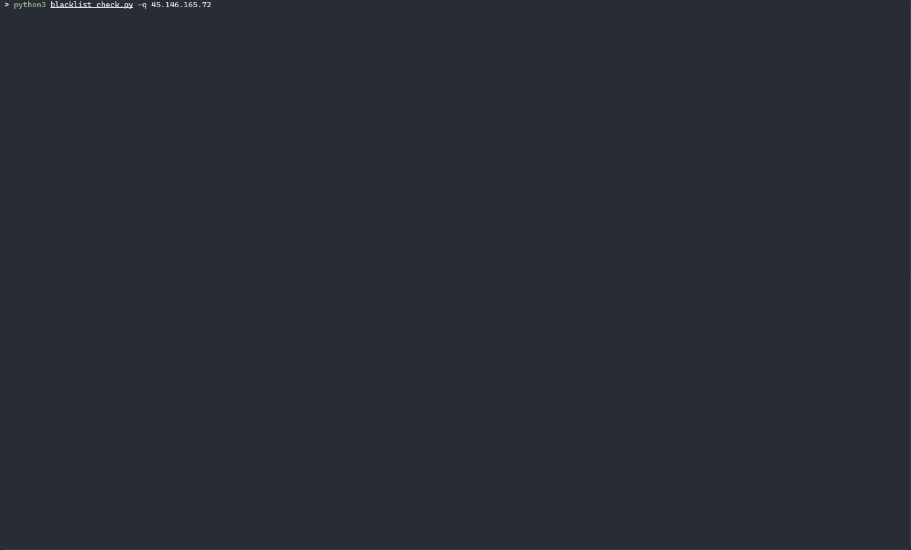

# IP Blacklist Check

 [](https://twitter.com/pulsecode)

Python script to download blacklists from various sources and check IP addresses against those blacklists. Utilizes the FreeGeopIP Live service for IP geolocation. (ref: <https://freegeoip.live/)>

## Installation

```text
git clone https://github.com/dfirsec/blacklist_check.git
cd blacklist_check
pip install -r requirements.txt
```

## Usage

```console
        ____  __           __   ___      __     ________              __
       / __ )/ /___ ______/ /__/ (_)____/ /_   / ____/ /_  ___  _____/ /__
      / __  / / __ `/ ___/ //_/ / / ___/ __/  / /   / __ \/ _ \/ ___/ //_/
     / /_/ / / /_/ / /__/ ,< / / (__  ) /_   / /___/ / / /  __/ /__/ ,<
    /_____/_/\__,_/\___/_/|_/_/_/____/\__/   \____/_/ /_/\___/\___/_/|_|

usage: blacklist_check.py [-h] [-u] [-s] [-q query [query ...]] [-w] [-f file] [-i insert insert] [-r remove]

IP Blacklist Check

optional arguments:
  -h, --help            show this help message and exit
  -t [threads]          threads for rbl check (default 25, max 50)
  -u                    update blacklist feeds
  -fu                   force update of all feeds
  -s                    show blacklist feeds
  -vt                   check virustotal for ip info
  -q query [query ...]  query a single or multiple ip addrs
  -f file               query a list of ip addresses from file
  -i                    insert a new blacklist feed
  -r                    remove an existing blacklist feed
```

#### Example Run



### Check if IP is blacklisted

#### Single

```text
python blacklist_check.py" -q 104.152.52.31

✖  Blacklisted [104.152.52.31] > Alien Vault Reputation
   Location: United States (US)

✖  Blacklisted [104.152.52.31] > CI Army Badguys
   Location: United States (US)

................................
[ Reputation Block List Check ]
✖  Blacklisted > abuse-contacts.abusix.org
✖  Blacklisted > abuse.spfbl.net
✖  Blacklisted > all.s5h.net
✖  Blacklisted > black.dnsbl.brukalai.lt
✖  Blacklisted > contacts.abuse.net
✖  Blacklisted > dnsbl.justspam.org
✖  Blacklisted > dnsbl.rymsho.ru
✖  Blacklisted > dnsbl.spfbl.net
✖  Blacklisted > dnsbl-2.uceprotect.net
✖  Blacklisted > free.v4bl.org
✖  Blacklisted > light.dnsbl.brukalai.lt
✖  Blacklisted > origin.asn.spameatingmonkey.net
✖  Blacklisted > origin.asn.cymru.com
✖  Blacklisted > peer.asn.cymru.com
✖  Blacklisted > rbl.rbldns.ru

[*] 104.152.52.31 is listed in 15 block lists

................................
[ IP-46 IP Intel Check ]
294 attacks reported for 104.152.52.31 (mainly by Port Scan). 104.152.52.31 is an Open Proxy used by Hackers

................................
[ URLhaus Check ]
✔  NOT LISTED
```

#### Multiple inline

```text
python blacklist_check.py -q 5.255.250.96, 78.46.85.236, 46.229.168.146

✔  NOT LISTED  [5.255.250.96]
   Location: Moscow, Russia (RU)
   Whois:  38 Merrimac St., Suite 201, Newburyport, MA 01950


✔  NOT LISTED  [78.46.85.236]
   Location: Germany (DE)
   Whois:  Hetzner Online AG


✔  NOT LISTED  [46.229.168.146]
   Location: Ashburn, Virginia (US)
   Whois:  Advanced Hosters B.V.
```

#### Multiple from file

```text
python blacklist_check.py -f ip_list.txt
```

#### VirusTotal Check (requires api key)

```text
python blacklist_check.py -q 3.135.65.187 -vt
................................
[ VirusTotal Check ]
Please add VT API key to the 'settings.yml' file, or enter it below
Enter key: <API KEY>
= URLs =
> http://3.135.65.187/
  Positives: 2
  Scan Date: 2020-12-03 03:29:33

> http://3.135.65.187/iejbl7.rar/
  Positives: 6
  Scan Date: 2020-12-03 03:16:08

> http://3.135.65.187/iejbl7.rar
  Positives: 7
  Scan Date: 2020-12-03 01:33:59

> https://3.135.65.187/
  Positives: 2
  Scan Date: 2020-12-03 01:10:16

> http://3.135.65.187/ek2atk2q.zip
  Positives: 8
  Scan Date: 2020-11-19 14:07:04

> http://3.135.65.187/goal.php
  Positives: 2
  Scan Date: 2020-11-17 19:04:07

> http://3.135.65.187/wp-content/uploads/2020/10/zinold.php
  Positives: 1
  Scan Date: 2020-11-05 06:41:45

= Hashes =
> 2aa35dc4f75e7a7a3e26561c5f051a50c4c13f90a3e2ac2c663139868f35f09f
  Positives: 19
  Date: 2020-12-02 20:07:21

> f2e354c9a4a21528e843122e38ed656d665a5e32141e26a1d60602a382d44912
  Positives: 20
  Date: 2020-11-19 12:02:02

> 83c390d82e19beec14d007b7350f4296c23ce9b3d131a3670ebb7424ad917410
  Positives: 12
  Date: 2020-11-18 22:42:02

> d49f5b9b3da2c5ae18f28c40d008544337ba6e5febd76a8c88619079d0c262ca
  Positives: 19
  Date: 2020-11-18 11:43:21
```
