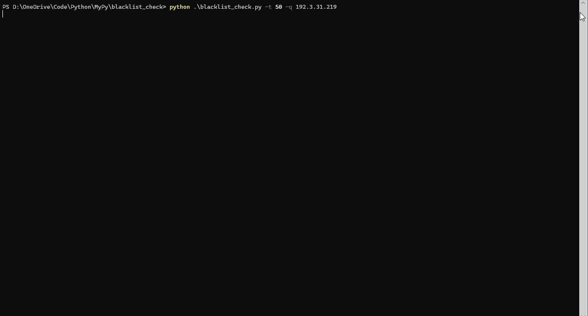

# IP Blacklist Check

 [](https://twitter.com/pulsecode)

Python script to download blacklists from various sources and check IP addresses against those blacklists.  Utilizes the FreeGeopIP Live service for IP geolocation. (ref: <https://freegeoip.live/)>

## Installation

```text
git clone https://github.com/dfirsec/blacklist_check.git
cd blacklist_check
pip install -r requirements.txt
```

## Usage

```console
        ____  __           __   ___      __     ________              __
       / __ )/ /___ ______/ /__/ (_)____/ /_   / ____/ /_  ___  _____/ /__
      / __  / / __ `/ ___/ //_/ / / ___/ __/  / /   / __ \/ _ \/ ___/ //_/
     / /_/ / / /_/ / /__/ ,< / / (__  ) /_   / /___/ / / /  __/ /__/ ,<
    /_____/_/\__,_/\___/_/|_/_/_/____/\__/   \____/_/ /_/\___/\___/_/|_|
     v2.0

usage: blacklist_check.py [-h] [-u] [-s] [-q query [query ...]] [-w] [-f file] [-i insert insert] [-r remove]

IP Blacklist Check

optional arguments:
  -h, --help            show this help message and exit
  -u                    Update set of Blacklisted IPs
  -s                    Show/Sort Blacklist Feeds by Name or Count
  -q query [query ...]  Query a single or list of IPs against Blacklist
  -w                    Perform IP whois lookup
  -f file               Blacklist check a list of IPs from file
  -i insert insert      Insert new Blacklist feed. Use comma-separated key-value pair: "Blacklist Name", "URL"
  -r remove             Remove Blacklist feed
  ```
#### Example Run
  

### Update Blacklisted IPs from feeds

  ```text
  python blacklist_check.py -u

 [ Updating ]
  ➜  Alien Vault Reputation
  ➜  Bambenek Consulting
  ➜  Bitcoin Nodes
  ➜  Blocklist DE
  ➜  Bot Scout IPs
  ➜  Brute Force Blocker
  ➜  CI Army Badguys
  ➜  Coin Blacklist Hosts
  ➜  CyberCrime
  ➜  Danger Rulez
  ➜  Darklist DE
  ➜  ET Compromised
  ➜  ET Tor Rules
  ➜  IP Spamlist
  ➜  MalC0de Blacklist
  ➜  Malware Army
  ➜  Malware Domains
  ➜  Mirai Security
  ➜  MyIP Blacklist
  ➜  SSL Abuse IP List
  ➜  SpamHaus Drop
  ➜  Stop Forum Spam
  ➜  Talos Intel
  ➜  Threat Crowd
  ➜  Threatweb Botnet IPs
  ➜  Threatweb Watchlist
  ➜  URL Haus
  ➜  WindowsSpyBlocker
```

### Show count of Blacklisted IPs

```text
python blacklist_check.py -s

LIST                      COUNT
-----------------------------------
Alien Vault Reputation   : 36112
Bambenek Consulting      : 564
Bitcoin Nodes            : 7762
Blocklist DE             : 25879
Bot Scout IPs            : 56
Brute Force Blocker      : 625
CI Army Badguys          : 14987
Coin Blacklist Hosts     : 7358
CyberCrime               : 2334
Danger Rulez             : 627
Darklist DE              : 7746
ET Compromised           : 622
ET Tor Rules             : 7114
IP Spamlist              : 50
MalC0de Blacklist        : 21
Malware Army             : 4383
Malware Domains          : 996
Mirai Security           : 999
MyIP Blacklist           : 1145
SSL Abuse IP List        : 86
SpamHaus Drop            : 48
Stop Forum Spam          : 178470
Talos Intel              : 1320
Threat Crowd             : 976
Threatweb Botnet IPs     : 313
Threatweb Watchlist      : 745
URL Haus                 : 96865
Windows SpyBlocker       : 358

➜  Last Modified: 2020-01-30 07:22:35
```

### Insert new Blacklist feed
```text
python blacklist_check.py" -i 
        ____  __           __   ___      __     ________              __
       / __ )/ /___ ______/ /__/ (_)____/ /_   / ____/ /_  ___  _____/ /__
      / __  / / __ `/ ___/ //_/ / / ___/ __/  / /   / __ \/ _ \/ ___/ //_/
     / /_/ / / /_/ / /__/ ,< / / (__  ) /_   / /___/ / / /  __/ /__/ ,<
    /_____/_/\__,_/\___/_/|_/_/_/____/\__/   \____/_/ /_/\___/\___/_/|_|
     v2.0
     
Feed name: Windows SpyBlocker
Feed url: https://raw.githubusercontent.com/crazy-max/WindowsSpyBlocker/master/data/firewall/extra.txt

[ Checking URL ]
✔  URL is good
✔  Added feed: "Windows SpyBlocker": "https://raw.githubusercontent.com/crazy-max/WindowsSpyBlocker/master/data/firewall/extra.txt"

[ Updating new feed ]
✔  371 IPs added to 'Windows SpyBlocker'
```

### Remove Blacklist feed
Removes entry from both the feeds and blacklist
```
python blacklist_check.py" -r
 1) Alien Vault Reputation   http://reputation.alienvault.com/reputation.data
 2) Bambenek Consulting      https://osint.bambenekconsulting.com/feeds/c2-masterlist.txt
 3) Bitcoin Nodes            https://raw.githubusercontent.com/firehol/blocklist-ipsets/master/bitcoin_nodes.ipset
 4) Blocklist DE             http://www.blocklist.de/lists/all.txt
 5) Bot Scout IPs            https://raw.githubusercontent.com/firehol/blocklist-ipsets/master/botscout.ipset
 6) Brute Force Blocker      https://panwdbl.appspot.com/lists/bruteforceblocker.txt
 7) CI Army Badguys          http://www.ciarmy.com/list/ci-badguys.txt
 8) Coin Blacklist Hosts     https://raw.githubusercontent.com/firehol/blocklist-ipsets/master/coinbl_hosts.ipset
 9) CyberCrime               https://raw.githubusercontent.com/firehol/blocklist-ipsets/master/cybercrime.ipset
10) Danger Rulez             http://danger.rulez.sk/projects/bruteforceblocker/blist.php
11) Darklist DE              https://www.darklist.de/raw.php
12) ET Compromised           https://rules.emergingthreats.net/blockrules/compromised-ips.txt
13) ET Tor Rules             https://rules.emergingthreats.net/blockrules/emerging-tor.rules
14) GreenSnow                https://blocklist.greensnow.co/greensnow.txt
15) IP Spamlist              http://www.ipspamlist.com/public_feeds.csv
16) MalC0de Blacklist        http://malc0de.com/bl/IP_Blacklist.txt
17) Malware Army             https://malware.army/api/honey_iplist
18) Malware Domains          http://www.malwaredomainlist.com/hostslist/ip.txt
19) Mirai Security           https://mirai.security.gives/data/ip_list.txt
20) MyIP Blacklist           https://www.myip.ms/files/blacklist/csf/latest_blacklist.txt
21) OpenPhish                https://openphish.com/feed.txt
22) PhishTank                http://data.phishtank.com/data/online-valid.csv
23) SSL Abuse IP List        https://panwdbl.appspot.com/lists/sslabuseiplist.txt
24) SpamHaus Drop            https://panwdbl.appspot.com/lists/shdrop.txt
25) Stop Forum Spam          https://raw.githubusercontent.com/firehol/blocklist-ipsets/master/stopforumspam.ipset
26) Talos Intel              https://talosintelligence.com/documents/ip-blacklist
27) Threat Crowd             https://www.threatcrowd.org/feeds/ips.txt
28) Threatweb Botnet IPs     https://www.threatweb.com/access/Botnet-IPs-High_Confidence_BL.txt
29) Threatweb Watchlist      https://www.threatweb.com/access/SIEM/OPTIV_HIGH_CONFIDENCE_SIEM_IP_WATCHLIST.txt
30) URL Haus                 https://urlhaus.abuse.ch/downloads/csv_recent/
31) Windows SpyBlocker       https://raw.githubusercontent.com/crazy-max/WindowsSpyBlocker/master/data/firewall/extra.txt

Please select your choice by number: 31
✔ Successfully removed feed: "Windows SpyBlocker"
```

### Check if IP is blacklisted

#### Single
 ```text
python blacklist_check.py" -q 104.152.52.31
  
✘ BLACKLISTED by: Alien Vault Reputation

✘ BLACKLISTED by: Blocklist DE

✘ BLACKLISTED by: GreenSnow

------------ IP Info ------------
IP:        104.152.52.31
Location:  United States (US)
..............................
[ Performing DNS Blacklist check ]
✖  Blacklisted > abuse-contacts.abusix.org
✖  Blacklisted > bl.fmb.la
✖  Blacklisted > cbl.abuseat.org
✖  Blacklisted > dnsbl.justspam.org
✖  Blacklisted > dnsbl.isx.fr
✖  Blacklisted > dnsbl.spfbl.net
✖  Blacklisted > all.s5h.net
✖  Blacklisted > free.v4bl.org
✖  Blacklisted > origin.asn.cymru.com
✖  Blacklisted > origin.asn.spameatingmonkey.net
✖  Blacklisted > peer.asn.cymru.com
✖  Blacklisted > zen.spamhaus.org
```

#### Multiple inline

```text
python blacklist_check.py -q 5.255.250.96, 78.46.85.236, 46.229.168.146
  
✘ BLACKLISTED by: MyIP Blacklist

------------ IP Info ------------
IP:        46.229.168.146
Location:  Ashburn, Virginia (US)
Whois:     Advanced Hosters B.V.


✔  NOT LISTED 
-----------------------------------
IP:        5.255.250.96
Location:  Moscow, Russia (RU)


✔  NOT LISTED 
-----------------------------------
IP:        78.46.85.236
Location:  Germany (DE)
```

#### Multiple from file

```text
python blacklist_check.py -f ip_list.txt
  
✘ BLACKLISTED by: MyIP Blacklist

------------ IP Info ------------
IP:        46.229.168.146
Location:  Ashburn, Virginia (US)
Whois:     Advanced Hosters B.V.


✔  NOT LISTED 
-----------------------------------
IP:        5.255.250.96
Location:  Moscow, Russia (RU)


✔  NOT LISTED 
-----------------------------------
IP:        78.46.85.236
Location:  Germany (DE)
```

#### IP Whois Lookup

```text
python blacklist_check.py -q 75.62.69.12, 12.16.5.23, 87.56.25.4, 18.23.36.2 -w

..............................
[ Performing IP whois lookup ]


✔  NOT LISTED 
-----------------------------------
IP:        75.62.69.12
Location:  Allen, Texas (US)
Whois:     AT&T Corp.


✔  NOT LISTED 
-----------------------------------
IP:        12.16.5.23
Location:  United States (US)
Whois:     AT&T Services, Inc.


✔  NOT LISTED 
-----------------------------------
IP:        87.56.25.4
Location:  Denmark (DK)
Whois:     TDC BB-ADSL users


✔  NOT LISTED 
-----------------------------------
IP:        18.23.36.2
Location:  United States (US)
Whois:     Massachusetts Institute of Technology
```
